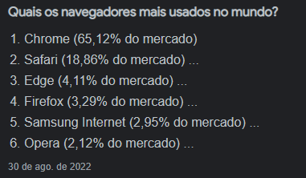

# Hello, JavaScript!

A primeira versão da Linguagem JavaScript foi lançada em 1995, pela Netscape Communications Corporation, junto com a Sun Microsystems. Alguns browsers possuíam suporte para a Linguagem JavaScript, outros browsers não. Há 25 anos havia, na verdade, uma *guerra dos browsers*, e o browser que predominava era o Netscape Navigator.

Porém, um levantamento realizado em 2022 apontou o seguinte:

Contudo, embora seja o mais usado, pesquisas citam que a Engine JavaScript dos browsers diferem (e muito) na sua agilidade.

O pódio, por enquanto, tem os seguintes browsers:
- 1º: Safari (Apenas MacOS)
- 2º: Edge (Versão atualizada)
- 3º: Google Chrome
- 4º: Mozilla Firefox

Os arquivos JS (JavaScript) se destacam no desenvolvimento de páginas para internet, junto com os arquivos HTML (HyperText Markup Language) e CSS (Cascarding Style Sheets).
- O HTML estrutura o conteúdo de uma página web e define a marcação dos elementos que compõem a página.
- O CSS determina os estilos e formatação dos elementos (aparência: cor, bordas, espaçamentos, posicionamentos, etc.).
- O JS define o comportamento dos elementos. Por meio do JS é possível interagir com os visitantes da página web, salvar dados do usuário, recuperar dados, auxiliar em layouts, etc.

No que respeita a pódio, a linguagem JavaScript é, atualmente, a mais utilizada no mundo, conforme números fornecidos pelo GitHub, sobre os repositórios armazenados na plataforma.

Por mais que ocorra uma diminuição da utilização da linguagem JavaScript, fique tranquilo. Para essa disciplina, ela cumpre (e muito bem) o seu propósito, que é o aprendizado de conceitos de Programação.

Veja o que é possível fazer com códigos JavaScript, de forma bem simples:

- Uma calculadora
- Uma lista de tarefas
- 